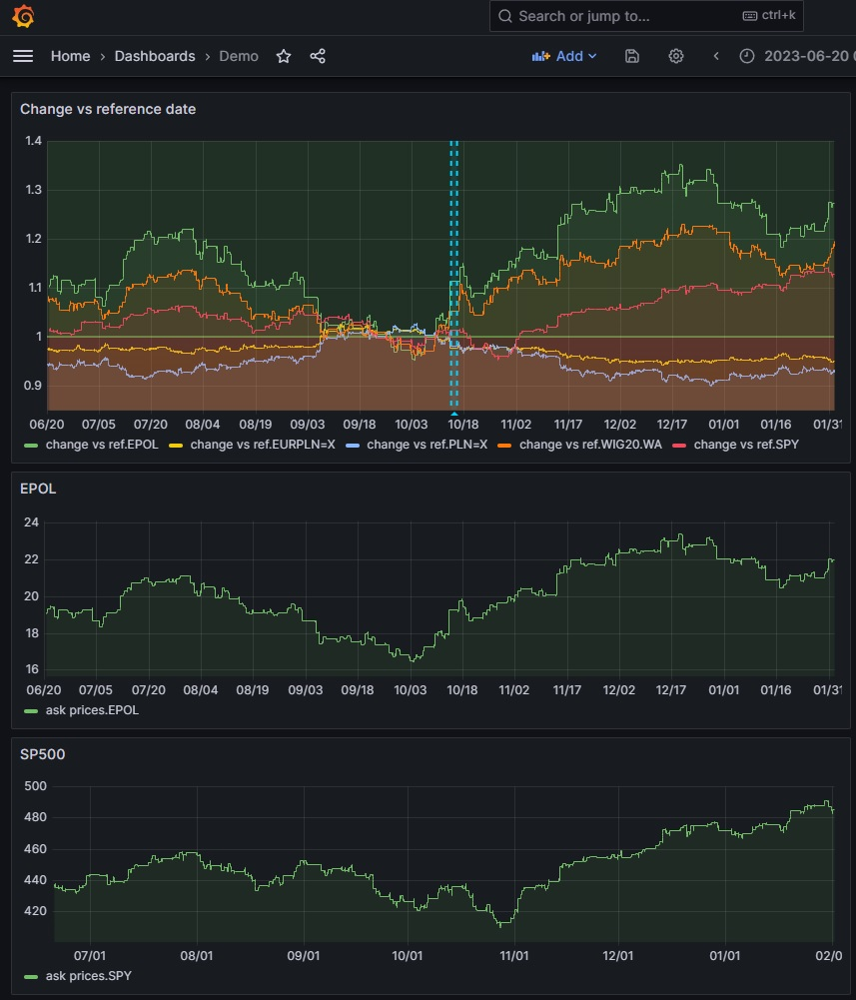

# Simple tool for visualising live changes in price of stocks, currencies and ETFs with regard to reference date

## How to run
Install [InfluxDB OSS](https://www.influxdata.com/downloads/)
Install [Grafana OSS](https://grafana.com/grafana/download?pg=oss-graf&plcmt=hero-btn-1&edition=oss)

and python libraries: influxdb-client, yfinance

```
pip install yfinance --upgrade --no-cache-dir
pip install influxdb-client
```

Configure InfluxDB to obtain your organization name, bucket name and API token: https://docs.influxdata.com/influxdb/v2/get-started/setup/


Connect InfluxDB to Grafana as data source: https://grafana.com/docs/grafana/latest/datasources/influxdb/

In Grafana, import demo dashboard from .json file: https://grafana.com/docs/grafana/latest/dashboards/build-dashboards/import-dashboards/

Configure and run etl.py (details below)

## ETL configuration
store your token in the `api.key` file

populate the following constant variables
* `LIVE_POOLING` : set to `False` to only obtain historical data, without live updates
* `TICKERS` : list the tickers to analyse with the names seen in https://finance.yahoo.com/
* `REF_DATE` : reference date in `yyyy-mm-dd` format, setting the baseline for relative prices 
* `ORG` : InfluxDB organization name
* `URL` : InfluxDB URL (leave clocalhost:8086 if default unchanged)

